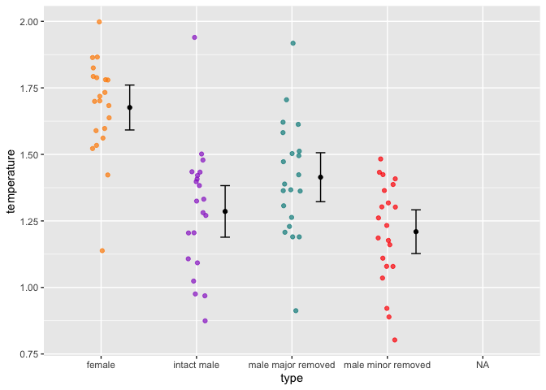

Lab 6 Comparing two means
================
Hamze Omar
23/04/2020

``` r
# load packages -----------------------------------------------------------

library(tidyverse)
```

    ## ── Attaching packages ─────────────────────────────────────── tidyverse 1.3.0 ──

    ## ✓ ggplot2 3.3.3     ✓ purrr   0.3.4
    ## ✓ tibble  3.1.0     ✓ dplyr   1.0.5
    ## ✓ tidyr   1.1.3     ✓ stringr 1.4.0
    ## ✓ readr   1.4.0     ✓ forcats 0.5.0

    ## ── Conflicts ────────────────────────────────────────── tidyverse_conflicts() ──
    ## x dplyr::filter() masks stats::filter()
    ## x dplyr::lag()    masks stats::lag()

``` r
# read data ---------------------------------------------------------------

fish <- read_csv("chap12q19ElectricFish(1).csv")
```

    ## 
    ## ── Column specification ────────────────────────────────────────────────────────
    ## cols(
    ##   tributary = col_character(),
    ##   speciesUpstream = col_double(),
    ##   speciesDownstream = col_double()
    ## )

``` r
fish_long <- 
  pivot_longer(fish, speciesUpstream:speciesDownstream,
               names_to = "location",
               values_to = "species") %>% 
  mutate(location = str_remove(location, c("species"))) %>% 
  print()
```

    ## # A tibble: 24 x 3
    ##    tributary location   species
    ##    <chr>     <chr>        <dbl>
    ##  1 Içá       Upstream        14
    ##  2 Içá       Downstream      19
    ##  3 Jutaí     Upstream        11
    ##  4 Jutaí     Downstream      18
    ##  5 Japurá    Upstream         8
    ##  6 Japurá    Downstream       8
    ##  7 Coari     Upstream         5
    ##  8 Coari     Downstream       7
    ##  9 Purus     Upstream        10
    ## 10 Purus     Downstream      16
    ## # … with 14 more rows

``` r
fish_long_data <- fish_long %>% 
  group_by(location) %>% 
  summarize(
    n = n(),
    mean = mean(species),
    sd = sd(species),
    sem = sd/sqrt(n),
    upper = mean + 1.96 * sem,
    lower = mean - 1.96 * sem
  ) %>% 
  print()
```

    ## # A tibble: 2 x 7
    ##   location       n  mean    sd   sem upper lower
    ##   <chr>      <int> <dbl> <dbl> <dbl> <dbl> <dbl>
    ## 1 Downstream    12  16.4  7.22  2.08  20.5  12.3
    ## 2 Upstream      12  14.6  7.93  2.29  19.1  10.1

Researchers studying the number of electric fish species living in
various parts of the Amazon basin were interested in whether the
presence of tributaries affected the local number of electric fish
species in the main rivers (Fernandes et al. 2004).

They counted the number of electric fish species above and below the
entrance point of a major tributary at 12 different river locations.

The data is provided in your GitHub repository.

For each question below, write a sentence answering the question and
show the code you used to come up with the answer, if applicable.

## Question A

> What is the mean different in the number of species between areas
> upstream and downstream of a tributary? What is the 95% confidence
> interval of this mean difference. Show your code and write a sentence
> giving your answer

## ANSWER

I will write my calculation of the mean differences below.

# the mean difference of upstream and downstream

downstream mean = 16.41667, upstream mean = 14.58333, difference =
1.83334

# 95% confidence interval

UCI = 8.253697 LCI = -4.587031

``` r
t.test(formula = species ~ location, data = fish_long)
```

    ## 
    ##  Welch Two Sample t-test
    ## 
    ## data:  species by location
    ## t = 0.59249, df = 21.81, p-value = 0.5596
    ## alternative hypothesis: true difference in means is not equal to 0
    ## 95 percent confidence interval:
    ##  -4.587031  8.253697
    ## sample estimates:
    ## mean in group Downstream   mean in group Upstream 
    ##                 16.41667                 14.58333

## Question B

> Test the hypothesis that the tributaries have no effect on the number
> of species of electric fish.

# ANSWER

The P-value indicates that it’s greater than the alpha level of 0.05, in
that case we failed to reject the null hypothesis. P-value is 0.5596,
this means there’s 55%.

``` r
t.test(formula = species ~ location, data = fish_long)
```

    ## 
    ##  Welch Two Sample t-test
    ## 
    ## data:  species by location
    ## t = 0.59249, df = 21.81, p-value = 0.5596
    ## alternative hypothesis: true difference in means is not equal to 0
    ## 95 percent confidence interval:
    ##  -4.587031  8.253697
    ## sample estimates:
    ## mean in group Downstream   mean in group Upstream 
    ##                 16.41667                 14.58333

``` r
fish_long %>% 
    ggplot(aes(x = location, y = species)) +
    geom_jitter(aes(color = location), 
                shape = 16, size = 3, 
                alpha = 0.3, width = 0.4) +
    geom_errorbar(aes(y = mean, ymax = upper, ymin = lower), 
                  data = fish_long_data, 
                  width = .1, size = .8) +
    geom_point(aes(y = mean), 
               data = fish_long_data, 
               size = 3) +
    scale_color_manual(values = c("dark blue","red")) +
    theme_minimal() +
    guides(color = "none")
```

<!-- -->

## Question C

> State the assumptions that you had to make to complete parts (A) and
> (B). Create a graph to assess whether one of those assumptions was
> met.

# ANSWER

The distribution is not normally distributed and the means of both
variables show some differences. From the previous calculation, it tells
us that the true mean difference isn’t equal to zero.

``` r
fish_long %>% 
    ggplot(aes(x = species)) +
    geom_histogram(
      aes(fill = location), 
      bins = 20, 
      alpha = 0.5, 
      position = "identity"
    ) +
    scale_fill_manual(values = c("darkorange","cyan4")) +
    theme_minimal()
```

<!-- -->

``` r
crab_fans_data <- read_csv("chap15q27FiddlerCrabFans.csv") %>%
    rename(type = crabType, temperature = bodyTemperature)
```

    ## 
    ## ── Column specification ────────────────────────────────────────────────────────
    ## cols(
    ##   crabType = col_character(),
    ##   bodyTemperature = col_double()
    ## )

``` r
  crab_fans_data
```

    ## # A tibble: 85 x 2
    ##    type   temperature
    ##    <chr>        <dbl>
    ##  1 female         1.9
    ##  2 female         1.6
    ##  3 female         1.4
    ##  4 female         1.1
    ##  5 female         1.6
    ##  6 female         1.8
    ##  7 female         1.9
    ##  8 female         1.7
    ##  9 female         1.5
    ## 10 female         1.8
    ## # … with 75 more rows

## ANOVA

Fiddler crabs are so called because males have a greatly enlarged
“major” claw, which is used to attract females and to defend a
burrow.

Darnell and Munguia (2011) recently suggested that this appendage might
also act as a heat sink, keeping males cooler while out of the burrow on
hot days.

To test this, they placed four groups of crabs into separate plastic
cups and supplied a source of radiant heat (60-watt light bulb) from
above. The four groups were intact male crabs, male crabs with the major
claw removed; male crabs with the other (minor) claw removed (control);
and intact female fiddler crabs.

They measured the body temperature of crabs every 10 minutes for 1.5
hours. These measurements were used to calculate a rate of heat gain for
every individual crab in degrees C/log minute. Rates of heat gain for
all crabs are provided in the accompanying data file.

### Question D

Graph the distribution of body temperatures for each crab type:

``` r
temperature_means <-
    crab_fans_data %>%
    filter(!is.na(temperature)) %>%      # remove missing values
    group_by(type) %>%
    summarize(
      mean = mean(temperature),
      sd = sd(temperature),
      n = n(),
      sem = sd / sqrt(n),
      upper = mean + 1.96 * sem,
      lower = mean - 1.96 * sem
    )

 ggplot(data = crab_fans_data, aes(x = type, y = temperature)) +
    geom_jitter(aes(color = type),
                width = 0.1,
                alpha = 0.7,
                show.legend = FALSE,
                na.rm = TRUE) +
    geom_errorbar(aes(y = mean, ymin = lower, ymax = upper), 
                  data = temperature_means,
                  width = .1, position = position_nudge(.3)) +
    geom_point(aes(y = mean), data = temperature_means,
               position = position_nudge(.3)) +
    scale_color_manual(values = c("darkorange","darkorchid","cyan4", "red"))
```

<!-- -->

### Question E

Does body temperature varies among crab types? State the null and
alternative hypothesis, conduct and ANOVA, and interpret the results.

Yes, body temp varies in different scenerios, for example if we look at
the female crab, they have the highest body temp. In addition if we
compare intact male, male major, and minor removed. Intact male shows
higher temp of heat, but if we subset from male major, the temp
decreases. On the minor male removed the heat temp still as high but
skuad to the left of the graph

``` r
 crab_fans_data %>% filter(!is.na(type)) %>% 
    ggplot(aes(x = temperature)) +
    geom_histogram(
      aes(fill = type), 
      bins = 10, 
      alpha = 0.5, 
      position = "identity", na.rm = TRUE
    ) + scale_fill_manual(values = c("darkorange","cyan4", "darkorchid", "red")) +
    theme_minimal() +
    facet_wrap(~type, ncol=1)
```

<!-- -->
